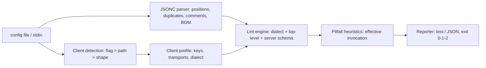

# plumbline

[English](README.md) | [中文](README.zh.md) | [日本語](README.ja.md)

[](LICENSE)   [](CONTRIBUTING.md)

**MCP クライアント設定ファイルのための、オープンソースかつ依存ゼロのリンター —— Claude Desktop・Cursor・VS Code がそれぞれどう設定を読むかを知っていて、すべての検出に修正案と安定コードを添える。**


```bash
# not yet on npm — install from a checkout of this repository
npm install && npm run build && npm pack
npm install -g ./plumbline-0.1.0.tgz
```

## なぜ plumbline？

MCP のセットアップは設定ファイルで失敗する。しかも音もなく失敗する。三大クライアントは同じ概念の*異なる*方言を読み、どれも理解できないものを黙って無視する。VS Code が求めるのは `servers`、Claude Desktop と Cursor が求めるのは `mcpServers` —— 設定をクライアント間でコピペすると、きれいに読み込まれて何も起きない。Claude Desktop のパーサーは厳格 JSON なので、VS Code の JSONC では合法だったコメント一つで全サーバーが消える。起動経路にシェルは存在しないため、`"command": "npx -y pkg"` も `~/Documents` も相対パスも、クライアントが決して説明しない形で死に、`-y` のない `npx` は誰にも見えないインストール確認で固まる。汎用 JSON リンターはファイルに問題なしと言い、JSON Schema は形は合っていると言い、クライアントはただ空のツール一覧を見せる。plumbline はまさにこれらのファイル専用のオフライン・ドクターだ。設定がどのクライアントのものかを検出し、他のツールが黙って畳んでしまう重複キーを保持する位置追跡型 JSONC パーサーで解析し、安定コード付きの 37 ルールをそのクライアントの実際の挙動に照らして採点し、すべての検出にそのまま貼れる修正を添える。

|  | plumbline | 汎用 JSON リンター | JSON Schema + バリデーター | MCP Inspector |
|---|---|---|---|---|
| 焦点 | MCP 設定の方言 + 起動の落とし穴 | JSON 構文 | 自前で維持する schema との照合 | サーバーのライブデバッグ |
| クライアント間の差異を知っている（`servers` vs `mcpServers`、JSONC vs 厳格） | はい —— E110/E102 を双方向で | いいえ | 3 つの schema を最新に保てば | いいえ —— 設定ツールではない |
| 起動の落とし穴（npx -y、`~`、cwd、cmd /c shim） | はい、実効的な起動コマンドで判定 | いいえ | いいえ | サーバーが落ちるのを見るだけ |
| 重複キー | 両方の位置つきで報告（E104） | まれ | いいえ —— パーサーが先に畳む | 対象外 |
| すべての検出に修正案 | はい、そのまま貼れる | いいえ | エラーパスのみ | いいえ |
| 動く場所 | あなたのターミナルと CI、完全オフライン | ターミナル | 自前のツールチェーン内 | ブラウザー UI + 稼働中サーバー |
| ランタイム依存 | 0 | まちまち | バリデーター一式 | Inspector アプリ |

<sub>各機能の注記は各プロジェクトの公開ドキュメントに照らして確認、2026-07。</sub>

## 特徴

- **各クライアントの方言を知っている** —— `mcpServers` vs `servers`、厳格 JSON vs JSONC、stdio のみ vs リモートトランスポート。同じバイト列でもクライアントごとに採点が変わり、レポートヘッダーには常にどの方言をなぜ使ったかが書かれる。
- **リント級 JSONC パーサーによる行番号つき検出** —— 重複したサーバー名は「後勝ち」で黙殺されず報告され（E104）、コメントと末尾カンマはクライアント別に採点され（致命的な E102/E103 vs 助言の I301）、JSON.parse を殺す UTF-8 BOM も捕まえる（W201）。
- **schema だけでなく起動の落とし穴も** —— `command` に埋め込まれた引数（E130）、`-y` のない `npx`（W206）、未定義 cwd からの相対パス（W207）、展開されない `~`（W208）、Windows で `cmd /c` が要る `.cmd` shim（W209）、インタープリターとスクリプトの不一致（W211）—— すべて実効的な起動コマンドで判定するので、一つの文字列に書かれた `"npx -y pkg"` も理解される。
- **すべての検出に修正案** —— 安定コード付き 37 ルール（E1xx/W2xx/I3xx）。キーの打ち間違いには did-you-mean（`cmd` → `command`）、Claude Desktop のリモートサーバーには正確な stdio ブリッジのレシピ、平文トークンにはクライアント別の助言（W210）。
- **三つのサブコマンド** —— `check` は一つ以上のファイルを検査。`clients` はクライアント別チートシート（パス・キー・トランスポート・方言）を出力。`explain` は全ルール・全クライアント・全概念をオフラインで解説。
- **CI のための設計、依存ゼロ** —— 決定的な出力、`--format json`、`--fail-on error|warning|info|never`、終了コード 0/1/2。必要なのは Node.js だけで、ツールがソケットを開くことは決してない。

## クイックスタート

インストール：

```bash
# not yet on npm — install from a checkout of this repository
npm install && npm run build && npm pack
npm install -g ./plumbline-0.1.0.tgz
```

同梱の壊れた設定を検査（クライアントはファイル名から自動判定）：

```bash
plumbline check examples/claude_desktop_config.json
```

出力（実際の実行記録、10 件中 4 件を抜粋）：

```text
examples/claude_desktop_config.json — Claude Desktop (auto-detected: file is named claude_desktop_config.json): 5 server(s) — 5 error(s), 5 warning(s), 0 info

  error E130 github › command  [line 4]
      Claude Desktop execs the command directly — no shell splits "npx -y @modelcontextprotocol/server-github" into a program plus flags, so the OS looks for a program with that literal name
      fix: "command": "npx", "args": ["-y", "@modelcontextprotocol/server-github"]

  warning W206 filesystem › args  [line 8]
      npx without -y stops at the install prompt on first run — inside Claude Desktop there is no terminal to answer it, so the server times out
      fix: add "-y" as the first element of "args"

  error E126 tickets › url  [line 16]
      Claude Desktop cannot launch remote servers from this file — claude_desktop_config.json only describes stdio servers, so this entry is ignored
      fix: bridge it through a stdio proxy: "command": "npx", "args": ["-y", "mcp-remote", "https://mcp.example.test/sse"] — or add it in the app's Connectors UI

  error E125 notes › cmd  [line 19]
      `cmd` is not a key Claude Desktop reads — it is silently ignored (did you mean `command`?)
      fix: rename the key to "command"

plumbline: FAIL — 5 error(s), 5 warning(s), 0 info (fail-on: warning)
```

終了コード 1 —— そのまま CI に組み込める。クリーンな対照版 `examples/clean-claude.json` は 0 で終了する。クロスクライアントの最凶バグは双方向で捕まえる（実際の実行記録）：

```bash
printf '{"servers": {"web": {"command": "npx", "args": ["-y", "x"]}}}' | plumbline check - --client claude
```

```text
<stdin> — Claude Desktop (--client): 0 server(s) — 1 error(s), 0 warning(s), 0 info

  error E110 (top level)  [line 1]
      `servers` is another client's container key — Claude Desktop reads `mcpServers`, so every server in this file is silently ignored
      fix: rename the key to "mcpServers"

plumbline: FAIL — 1 error(s), 0 warning(s), 0 info (fail-on: warning)
```

さらなるシナリオ（Cursor が詰まる JSONC ファイル、VS Code の `inputs` の間違い）は [examples/](examples/README.md) にある。

## クライアント方言

クライアント別の知識はデータとして `src/clients.ts` にあり、`plumbline clients` がターミナルに全マトリクスを出力、[docs/clients.md](docs/clients.md) が詳細版。

| | Claude Desktop | Cursor | VS Code |
|---|---|---|---|
| トップレベルキー | `mcpServers` | `mcpServers` | `servers`（+ `inputs`） |
| パーサー | 厳格 JSON | 厳格 JSON | JSONC |
| トランスポート | stdio のみ | stdio・sse・http | stdio・sse・http |
| `${...}` 変数 / `inputs` / `envFile` | 不可 | 不可 | 可 |
| 無関係なトップレベルキー | 合法（アプリ設定ファイルを兼ねる） | W204 を報告 | W204 を報告 |

## ルール

エラー（E1xx）は設定が読み込まれない・書いてある通りに動かない・サーバーが音もなく起動できないことを意味する。警告（W2xx）は何かが無視される・壊れやすい・安全でないことを意味する。情報（I3xx）は助言。コードは安定 API で、決して振り直されない。以下は抜粋で、根拠つきの完全カタログは [docs/rules.md](docs/rules.md)、`plumbline explain <code>` でオフライン表示できる。

| ルール | 深刻度 | 検出内容 |
|---|---|---|
| E102 / E103 | error | 厳格 JSON クライアントの設定内のコメント / 末尾カンマ |
| E104 | error | サーバー名の重複 —— 先の項目が音もなく敗れる |
| E110 / E111 | error | このクライアントに対して誤った/打ち間違えたトップレベルキー |
| E123 / E124 | error | `args` / `env` 内の文字列でない値 |
| E125 | error | 未知のサーバーキーに did-you-mean（`cmd`、`arguments`、大文字小文字） |
| E126 | error | Claude Desktop 内のリモート `url` サーバー、stdio ブリッジ修正つき |
| E130 | error | `command` 文字列に埋め込まれた引数 |
| E131 / E132 | error | `${input:...}` が未定義 / 変数を置換しないクライアントでの `${...}` |
| W206–W209 | warning | -y のない npx、相対パス、`~`、Windows の cmd /c shim |
| W210 | warning | 設定ファイル内の平文クレデンシャル |

## CLI リファレンス

`plumbline check` は一つ以上のファイル、または stdin を表す `-` を受け取る。`clients` と `explain <topic>` にファイルは不要。

| フラグ | 既定値 | 効果 |
|---|---|---|
| `--client <name>` | `auto` | 自動判定せず `claude`・`cursor`・`vscode` として検査 |
| `--fail-on <level>` | `warning` | `error`・`warning`・`info` 以上で 1 を返す。`never` は常に 0 |
| `--format text\|json` | `text` | レポート形式。JSON は CI 向けの安定した構造 |
| `-q, --quiet` | オフ | ファイルごとのサマリー行のみ |

終了コード：`0` は `--fail-on` 以上の検出なし、`1` は検出あり、`2` は用法または入力のエラー —— パイプラインが壊れた設定と壊れた呼び出しを区別できる。

## アーキテクチャ



## ロードマップ

- [x] 三つのクライアント方言、修正つき 37 ルールカタログ、パス/形状検出、`clients` + `explain` サブコマンド、JSON 出力（v0.1.0）
- [ ] クライアント追加：Windsurf・Zed・Claude Code（`.mcp.json`）・JetBrains
- [ ] `--fix`：安全な書き換えを設定ファイルに書き戻す
- [ ] `plumbline diff <old> <new>`：レビューしやすい設定の差分表示
- [ ] ワークスペーススキャン：ディレクトリ配下の全 MCP 設定を見つけ、各クライアントに照らして検査

完全なリストは [open issues](https://github.com/JaydenCJ/plumbline/issues) を参照。

## コントリビュート

コントリビュート歓迎。`npm install && npm run build` でビルドし、`npm test`（89 テスト）と `bash scripts/smoke.sh`（`SMOKE OK` を出力すること）を実行 —— このリポジトリは CI を持たず、上記の主張はすべてローカル実行で検証されている。[CONTRIBUTING.md](CONTRIBUTING.md) を読み、[good first issue](https://github.com/JaydenCJ/plumbline/issues?q=is%3Aissue+is%3Aopen+label%3A%22good+first+issue%22) を掴むか、[discussion](https://github.com/JaydenCJ/plumbline/discussions) を始めよう。

## ライセンス

[MIT](LICENSE)
