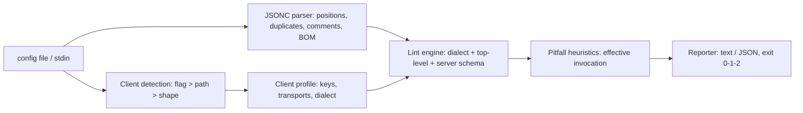

# plumbline

[English](README.md) | [中文](README.zh.md) | [日本語](README.ja.md)

[](LICENSE)   [](CONTRIBUTING.md)

**An open-source, zero-dependency linter for MCP client config files — it knows how Claude Desktop, Cursor and VS Code each read their config, and attaches a fix and a stable code to every finding.**


```bash
# not yet on npm — install from a checkout of this repository
npm install && npm run build && npm pack
npm install -g ./plumbline-0.1.0.tgz
```

## Why plumbline?

MCP setup fails in the config file, and it fails silently: the three big clients read *different* dialects of the same idea, and every one of them ignores what it does not understand. VS Code wants `servers` where Claude Desktop and Cursor want `mcpServers` — paste a config across and it loads cleanly and does nothing. Claude Desktop's parser is strict JSON, so the comment that was legal in VS Code's JSONC makes every server vanish. There is no shell in the launch path, so `"command": "npx -y pkg"`, `~/Documents` and relative paths all die in ways the client never explains, and `npx` without `-y` hangs on an install prompt nobody can see. A generic JSON linter says the file is fine; a JSON Schema says the shapes match; the client just shows an empty tool list. plumbline is a dedicated, offline doctor for exactly these files: it detects which client a config belongs to, parses it with a position-tracking JSONC parser that keeps the duplicate keys other tools silently fold, grades 37 stable-coded rules against that client's real behavior, and attaches a copy-pasteable fix to every finding.

|  | plumbline | generic JSON linter | JSON Schema + validator | MCP Inspector |
|---|---|---|---|---|
| Focus | MCP config dialects + launch pitfalls | JSON syntax | shapes vs a schema you maintain | live server debugging |
| Knows the clients differ (`servers` vs `mcpServers`, JSONC vs strict) | yes — E110/E102 in both directions | no | only if you keep 3 schemas current | no — it is not a config tool |
| Launch pitfalls (npx -y, `~`, cwd, cmd /c shims) | yes, judged on the effective invocation | no | no | you watch the server fail live |
| Duplicate keys | reported with both positions (E104) | rarely | no — parsers fold them first | n/a |
| Fix attached to every finding | yes, copy-pasteable | no | error path only | no |
| Where it runs | your terminal and CI, fully offline | terminal | inside your own tooling | browser UI + a running server |
| Runtime dependencies | 0 | varies | validator stack | Inspector app |

<sub>Capability notes checked against each project's public documentation, 2026-07.</sub>

## Features

- **Knows each client's dialect** — `mcpServers` vs `servers`, strict JSON vs JSONC, stdio-only vs remote transports: the same bytes grade differently per client, and the report header always says which dialect was used and why.
- **Line-numbered findings from a lint-grade JSONC parser** — duplicate server names are reported instead of silently last-wins (E104), comments and trailing commas are graded per client (fatal E102/E103 vs advisory I301), and the JSON.parse-killing UTF-8 BOM is caught (W201).
- **Launch pitfalls, not just schema** — args embedded in `command` (E130), `npx` without `-y` (W206), relative paths from an undefined cwd (W207), unexpanded `~` (W208), Windows `.cmd` shims needing `cmd /c` (W209), interpreter/script mismatches (W211) — judged on the effective invocation, so `"npx -y pkg"` in one string is understood.
- **A fix on every finding** — 37 stable-coded rules (E1xx/W2xx/I3xx); typo'd keys get a did-you-mean (`cmd` → `command`), a remote server in Claude Desktop gets the exact stdio-bridge recipe, plaintext tokens get per-client advice (W210).
- **Three subcommands** — `check` lints one or more files; `clients` prints the per-client cheat sheet (paths, keys, transports, dialect); `explain` documents every rule, client and concept, offline.
- **Built for CI, zero dependencies** — deterministic output, `--format json`, `--fail-on error|warning|info|never`, exit codes 0/1/2; Node.js is the only requirement and the tool never opens a socket.

## Quickstart

Install:

```bash
# not yet on npm — install from a checkout of this repository
npm install && npm run build && npm pack
npm install -g ./plumbline-0.1.0.tgz
```

Check the bundled broken config (the client is detected from the file name):

```bash
plumbline check examples/claude_desktop_config.json
```

Output (real captured run, abridged to 4 of the 10 findings):

```text
examples/claude_desktop_config.json — Claude Desktop (auto-detected: file is named claude_desktop_config.json): 5 server(s) — 5 error(s), 5 warning(s), 0 info

  error E130 github › command  [line 4]
      Claude Desktop execs the command directly — no shell splits "npx -y @modelcontextprotocol/server-github" into a program plus flags, so the OS looks for a program with that literal name
      fix: "command": "npx", "args": ["-y", "@modelcontextprotocol/server-github"]

  warning W206 filesystem › args  [line 8]
      npx without -y stops at the install prompt on first run — inside Claude Desktop there is no terminal to answer it, so the server times out
      fix: add "-y" as the first element of "args"

  error E126 tickets › url  [line 16]
      Claude Desktop cannot launch remote servers from this file — claude_desktop_config.json only describes stdio servers, so this entry is ignored
      fix: bridge it through a stdio proxy: "command": "npx", "args": ["-y", "mcp-remote", "https://mcp.example.test/sse"] — or add it in the app's Connectors UI

  error E125 notes › cmd  [line 19]
      `cmd` is not a key Claude Desktop reads — it is silently ignored (did you mean `command`?)
      fix: rename the key to "command"

plumbline: FAIL — 5 error(s), 5 warning(s), 0 info (fail-on: warning)
```

Exit code 1 — drop it into CI as-is. The clean twin `examples/clean-claude.json` exits 0. The cross-client killer is caught in both directions (real captured run):

```bash
printf '{"servers": {"web": {"command": "npx", "args": ["-y", "x"]}}}' | plumbline check - --client claude
```

```text
<stdin> — Claude Desktop (--client): 0 server(s) — 1 error(s), 0 warning(s), 0 info

  error E110 (top level)  [line 1]
      `servers` is another client's container key — Claude Desktop reads `mcpServers`, so every server in this file is silently ignored
      fix: rename the key to "mcpServers"

plumbline: FAIL — 1 error(s), 0 warning(s), 0 info (fail-on: warning)
```

More scenarios (a JSONC file that Cursor chokes on, VS Code `inputs` mistakes) live in [examples/](examples/README.md).

## Client dialects

The per-client knowledge lives as data in `src/clients.ts`; `plumbline clients` prints the full matrix in the terminal and [docs/clients.md](docs/clients.md) is the long-form version.

| | Claude Desktop | Cursor | VS Code |
|---|---|---|---|
| top-level key | `mcpServers` | `mcpServers` | `servers` (+ `inputs`) |
| parser | strict JSON | strict JSON | JSONC |
| transports | stdio only | stdio, sse, http | stdio, sse, http |
| `${...}` variables / `inputs` / `envFile` | no | no | yes |
| unrelated top-level keys | legal (app settings file) | flagged W204 | flagged W204 |

## Rules

Errors (E1xx) mean the config will not load, will not do what it says, or a server silently cannot start; warnings (W2xx) mean something is ignored, fragile or unsafe; info (I3xx) is advisory. Codes are stable API, never renumbered. Highlights below; the full catalog with rationale is in [docs/rules.md](docs/rules.md), and `plumbline explain <code>` prints it offline.

| Rule | Severity | Flags |
|---|---|---|
| E102 / E103 | error | comment / trailing comma in a strict-JSON client's config |
| E104 | error | duplicate server name — the earlier entry silently loses |
| E110 / E111 | error | wrong or typo'd top-level container key for this client |
| E123 / E124 | error | non-string values in `args` / `env` |
| E125 | error | unknown server key with a did-you-mean (`cmd`, `arguments`, casing) |
| E126 | error | remote `url` server in Claude Desktop, with the stdio-bridge fix |
| E130 | error | arguments embedded in the `command` string |
| E131 / E132 | error | `${input:...}` undefined / `${...}` in a client that never substitutes |
| W206–W209 | warning | npx without -y, relative paths, `~`, Windows cmd /c shims |
| W210 | warning | plaintext credential in the config file |

## CLI reference

`plumbline check` accepts one or more files or `-` for stdin. `clients` and `explain <topic>` need no files.

| Flag | Default | Effect |
|---|---|---|
| `--client <name>` | `auto` | lint as `claude`, `cursor` or `vscode` instead of auto-detecting |
| `--fail-on <level>` | `warning` | exit 1 at or above `error`, `warning`, `info`; `never` always exits 0 |
| `--format text\|json` | `text` | report format; JSON is a stable shape for CI |
| `-q, --quiet` | off | per-file summary lines only |

Exit codes: `0` no findings at/above `--fail-on`, `1` findings, `2` usage or input error — so a pipeline can tell a broken config from a broken invocation.

## Architecture



## Roadmap

- [x] Three client dialects, 37-rule catalog with fixes, path/shape detection, `clients` + `explain` subcommands, JSON output (v0.1.0)
- [ ] More clients: Windsurf, Zed, Claude Code (`.mcp.json`), JetBrains
- [ ] `--fix`: write the corrected config back with the safe rewrites applied
- [ ] `plumbline diff <old> <new>`: review-friendly config diffing
- [ ] Workspace scan: find every MCP config under a directory and lint each against its client

See the [open issues](https://github.com/JaydenCJ/plumbline/issues) for the full list.

## Contributing

Contributions are welcome. Build with `npm install && npm run build`, then run `npm test` (89 tests) and `bash scripts/smoke.sh` (must print `SMOKE OK`) — this repository ships no CI, every claim above is verified by local runs. See [CONTRIBUTING.md](CONTRIBUTING.md), grab a [good first issue](https://github.com/JaydenCJ/plumbline/issues?q=is%3Aissue+is%3Aopen+label%3A%22good+first+issue%22), or start a [discussion](https://github.com/JaydenCJ/plumbline/discussions).

## License

[MIT](LICENSE)
