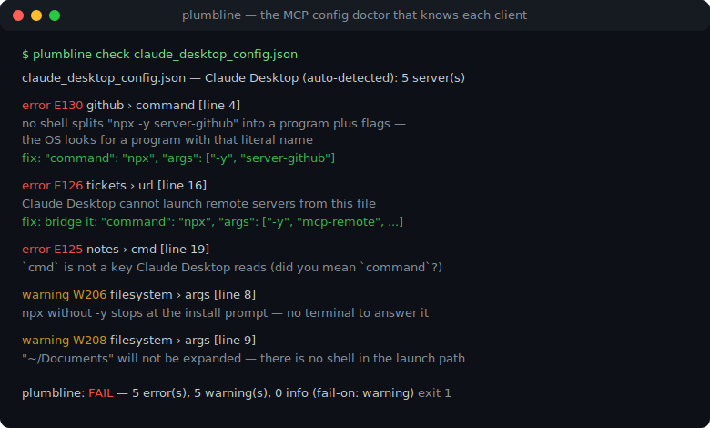
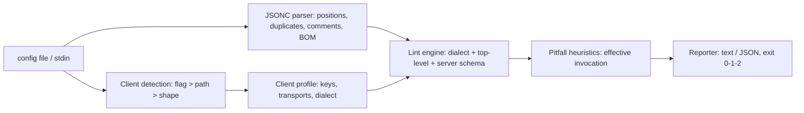

# plumbline

[English](README.md) | [中文](README.zh.md) | [日本語](README.ja.md)

[](LICENSE)   [](CONTRIBUTING.md)

**开源、零依赖的 MCP 客户端配置文件检查器 —— 它知道 Claude Desktop、Cursor 和 VS Code 各自如何读取配置，并给每条发现附上修复方案和稳定编码。**



```bash
# not yet on npm — install from a checkout of this repository
npm install && npm run build && npm pack
npm install -g ./plumbline-0.1.0.tgz
```

## 为什么选 plumbline？

MCP 配不通，问题几乎都出在配置文件里，而且是无声地出：三大客户端读的是同一个概念的*不同*方言，并且都会默默忽略自己看不懂的东西。VS Code 要的是 `servers`，Claude Desktop 和 Cursor 要的是 `mcpServers` —— 把配置跨客户端一粘贴，文件加载得干干净净，然后什么都不发生。Claude Desktop 的解析器是严格 JSON，在 VS Code 的 JSONC 里合法的那条注释会让所有服务器凭空消失。启动路径里没有 shell，所以 `"command": "npx -y pkg"`、`~/Documents` 和相对路径全都会以客户端永远不解释的方式死掉，而没加 `-y` 的 `npx` 会卡在一个谁也看不见的安装确认上。通用 JSON 检查器说文件没问题；JSON Schema 说形状都对；客户端只给你看一个空空的工具列表。plumbline 是专为这些文件而生的离线医生：它检测配置属于哪个客户端，用一个保留其他工具会默默折叠掉的重复键、带位置追踪的 JSONC 解析器来解析，用 37 条稳定编码的规则对照该客户端的真实行为打分，并给每条发现附上可直接粘贴的修复。

|  | plumbline | 通用 JSON 检查器 | JSON Schema + 校验器 | MCP Inspector |
|---|---|---|---|---|
| 定位 | MCP 配置方言 + 启动陷阱 | JSON 语法 | 对照你自己维护的 schema | 服务器实时调试 |
| 知道客户端之间的差异（`servers` vs `mcpServers`、JSONC vs 严格） | 是 —— E110/E102 双向检查 | 否 | 除非你维护 3 份最新 schema | 否 —— 它不是配置工具 |
| 启动陷阱（npx -y、`~`、cwd、cmd /c shim） | 是，按实际生效的调用来判断 | 否 | 否 | 只能眼看着服务器挂掉 |
| 重复键 | 报告且带两处位置（E104） | 很少 | 否 —— 解析器先折叠掉了 | 不适用 |
| 每条发现都附修复 | 是，可直接粘贴 | 否 | 只有错误路径 | 否 |
| 运行位置 | 你的终端和 CI，完全离线 | 终端 | 嵌入你自己的工具链 | 浏览器 UI + 运行中的服务器 |
| 运行时依赖 | 0 | 不一 | 校验器全家桶 | Inspector 应用 |

<sub>各项能力说明核对自各项目的公开文档，2026-07。</sub>

## 特性

- **懂每个客户端的方言** —— `mcpServers` vs `servers`、严格 JSON vs JSONC、仅 stdio vs 远程传输：同样的字节在不同客户端下评分不同，报告头永远写明用了哪种方言、为什么。
- **来自 lint 级 JSONC 解析器的带行号发现** —— 重复的服务器名会被报告而不是默默后者获胜（E104），注释和尾随逗号按客户端分级（致命的 E102/E103 vs 提示性的 I301），能干掉 JSON.parse 的 UTF-8 BOM 也会被抓住（W201）。
- **不止 schema，还有启动陷阱** —— 参数嵌进 `command`（E130）、`npx` 没加 `-y`（W206）、相对于未定义 cwd 的相对路径（W207）、未展开的 `~`（W208）、Windows 上需要 `cmd /c` 的 `.cmd` shim（W209）、解释器与脚本不匹配（W211）—— 全部按实际生效的调用判断，所以写成一个字符串的 `"npx -y pkg"` 也能被理解。
- **每条发现都附修复** —— 37 条稳定编码规则（E1xx/W2xx/I3xx）；写错的键给出 did-you-mean（`cmd` → `command`），Claude Desktop 里的远程服务器给出精确的 stdio 桥接配方，明文令牌按客户端给出建议（W210）。
- **三个子命令** —— `check` 检查一个或多个文件；`clients` 打印各客户端速查表（路径、键、传输、方言）；`explain` 离线解释每条规则、每个客户端和每个概念。
- **为 CI 而生，零依赖** —— 确定性输出、`--format json`、`--fail-on error|warning|info|never`、退出码 0/1/2；唯一的要求是 Node.js，且工具从不打开任何 socket。

## 快速上手

安装：

```bash
# not yet on npm — install from a checkout of this repository
npm install && npm run build && npm pack
npm install -g ./plumbline-0.1.0.tgz
```

检查自带的坏配置（客户端会从文件名自动识别）：

```bash
plumbline check examples/claude_desktop_config.json
```

输出（真实运行记录，10 条发现节选 4 条）：

```text
examples/claude_desktop_config.json — Claude Desktop (auto-detected: file is named claude_desktop_config.json): 5 server(s) — 5 error(s), 5 warning(s), 0 info

  error E130 github › command  [line 4]
      Claude Desktop execs the command directly — no shell splits "npx -y @modelcontextprotocol/server-github" into a program plus flags, so the OS looks for a program with that literal name
      fix: "command": "npx", "args": ["-y", "@modelcontextprotocol/server-github"]

  warning W206 filesystem › args  [line 8]
      npx without -y stops at the install prompt on first run — inside Claude Desktop there is no terminal to answer it, so the server times out
      fix: add "-y" as the first element of "args"

  error E126 tickets › url  [line 16]
      Claude Desktop cannot launch remote servers from this file — claude_desktop_config.json only describes stdio servers, so this entry is ignored
      fix: bridge it through a stdio proxy: "command": "npx", "args": ["-y", "mcp-remote", "https://mcp.example.test/sse"] — or add it in the app's Connectors UI

  error E125 notes › cmd  [line 19]
      `cmd` is not a key Claude Desktop reads — it is silently ignored (did you mean `command`?)
      fix: rename the key to "command"

plumbline: FAIL — 5 error(s), 5 warning(s), 0 info (fail-on: warning)
```

退出码 1 —— 可以原样放进 CI。干净的对照版 `examples/clean-claude.json` 退出码为 0。跨客户端头号杀手双向都能抓到（真实运行记录）：

```bash
printf '{"servers": {"web": {"command": "npx", "args": ["-y", "x"]}}}' | plumbline check - --client claude
```

```text
<stdin> — Claude Desktop (--client): 0 server(s) — 1 error(s), 0 warning(s), 0 info

  error E110 (top level)  [line 1]
      `servers` is another client's container key — Claude Desktop reads `mcpServers`, so every server in this file is silently ignored
      fix: rename the key to "mcpServers"

plumbline: FAIL — 1 error(s), 0 warning(s), 0 info (fail-on: warning)
```

更多场景（让 Cursor 噎住的 JSONC 文件、VS Code 的 `inputs` 错误）见 [examples/](examples/README.md)。

## 客户端方言

各客户端知识以数据形式放在 `src/clients.ts`；`plumbline clients` 在终端打印完整矩阵，[docs/clients.md](docs/clients.md) 是长文版。

| | Claude Desktop | Cursor | VS Code |
|---|---|---|---|
| 顶层键 | `mcpServers` | `mcpServers` | `servers`（+ `inputs`） |
| 解析器 | 严格 JSON | 严格 JSON | JSONC |
| 传输 | 仅 stdio | stdio、sse、http | stdio、sse、http |
| `${...}` 变量 / `inputs` / `envFile` | 否 | 否 | 是 |
| 无关的顶层键 | 合法（它就是应用设置文件） | 报 W204 | 报 W204 |

## 规则

错误（E1xx）意味着配置加载不了、不会按字面生效、或某个服务器会无声地起不来；警告（W2xx）意味着有东西被忽略、脆弱或不安全；信息（I3xx）是提示性的。编码是稳定 API，永不重编号。以下为精选；带原理的完整目录见 [docs/rules.md](docs/rules.md)，`plumbline explain <code>` 可离线打印。

| 规则 | 级别 | 检查内容 |
|---|---|---|
| E102 / E103 | error | 严格 JSON 客户端配置里的注释 / 尾随逗号 |
| E104 | error | 重复的服务器名 —— 前一个条目无声落败 |
| E110 / E111 | error | 顶层容器键用错或写错（针对当前客户端） |
| E123 / E124 | error | `args` / `env` 里的非字符串值 |
| E125 | error | 未知服务器键并给出 did-you-mean（`cmd`、`arguments`、大小写） |
| E126 | error | Claude Desktop 里的远程 `url` 服务器，附 stdio 桥接修复 |
| E130 | error | 参数嵌在 `command` 字符串里 |
| E131 / E132 | error | `${input:...}` 未定义 / `${...}` 用在从不替换变量的客户端 |
| W206–W209 | warning | npx 缺 -y、相对路径、`~`、Windows cmd /c shim |
| W210 | warning | 配置文件里的明文凭证 |

## CLI 参考

`plumbline check` 接受一个或多个文件，或 `-` 读 stdin。`clients` 和 `explain <topic>` 不需要文件。

| 选项 | 默认 | 效果 |
|---|---|---|
| `--client <name>` | `auto` | 按 `claude`、`cursor` 或 `vscode` 检查，跳过自动识别 |
| `--fail-on <level>` | `warning` | 在 `error`、`warning`、`info` 及以上退出 1；`never` 永远退出 0 |
| `--format text\|json` | `text` | 报告格式；JSON 是给 CI 的稳定结构 |
| `-q, --quiet` | 关 | 只输出每个文件的摘要行 |

退出码：`0` 没有达到 `--fail-on` 的发现，`1` 有发现，`2` 用法或输入错误 —— 流水线因此能区分坏配置和坏调用。

## 架构



## 路线图

- [x] 三种客户端方言、37 条带修复的规则目录、路径/形状识别、`clients` + `explain` 子命令、JSON 输出（v0.1.0）
- [ ] 更多客户端：Windsurf、Zed、Claude Code（`.mcp.json`）、JetBrains
- [ ] `--fix`：把安全的改写直接写回配置文件
- [ ] `plumbline diff <old> <new>`：便于评审的配置对比
- [ ] 工作区扫描：找出目录下所有 MCP 配置并按各自客户端逐一检查

完整列表见 [open issues](https://github.com/JaydenCJ/plumbline/issues)。

## 参与贡献

欢迎贡献。用 `npm install && npm run build` 构建，然后跑 `npm test`（89 个测试）和 `bash scripts/smoke.sh`（必须打印 `SMOKE OK`）—— 本仓库不带 CI，以上每条声明都由本地运行验证。参见 [CONTRIBUTING.md](CONTRIBUTING.md)，认领一个 [good first issue](https://github.com/JaydenCJ/plumbline/issues?q=is%3Aissue+is%3Aopen+label%3A%22good+first+issue%22)，或发起一个 [discussion](https://github.com/JaydenCJ/plumbline/discussions)。

## 许可证

[MIT](LICENSE)
